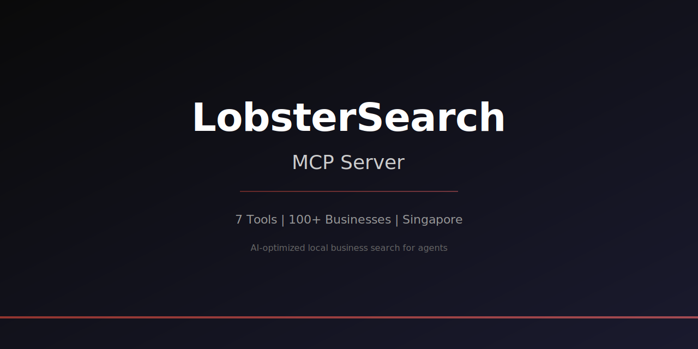

<p align="center">
  
</p>

<h3 align="center">Find the best local businesses through AI — 7 MCP tools, 100+ verified businesses</h3>

<p align="center">
  <a href="https://smithery.ai/server/lobstersearch"></a>
  
  
  
  
  
</p>

<p align="center">
  <b>No API key required. No setup. Connect and search.</b>
</p>

```bash
claude mcp add lobstersearch --transport streamable-http https://mcp.lobstersearch.ai/mcp
```

---

## What is LobsterSearch?

LobsterSearch is a GEO-optimized business directory purpose-built for AI agents. Unlike generic search results, every business includes structured services with pricing, operating hours, promotions, and confidence scores — giving AI agents the data they need to make reliable recommendations.

It's a hosted service. No setup, no API key, no self-hosting. Connect your MCP client and start searching.

---

## Quick Start

### Claude Code (recommended)

```bash
claude mcp add lobstersearch --transport streamable-http https://mcp.lobstersearch.ai/mcp
```

### Claude Desktop

Add to your `claude_desktop_config.json`:

```json
{
  "mcpServers": {
    "lobstersearch": {
      "url": "https://mcp.lobstersearch.ai/mcp",
      "transport": "streamable-http"
    }
  }
}
```

### Cursor

Add to Cursor's MCP settings (`Settings > MCP`):

```json
{
  "mcpServers": {
    "lobstersearch": {
      "url": "https://mcp.lobstersearch.ai/mcp",
      "transport": "streamable-http"
    }
  }
}
```

### Any MCP Client

Connect to `https://mcp.lobstersearch.ai/mcp` using **StreamableHTTP** transport. No authentication required.

---

## Tools Reference

### Search & Discovery

#### `search_businesses`

Search businesses by natural language query. Returns structured data with match relevance, quality signals, and confidence annotations.

| Parameter | Type | Required | Description |
|-----------|------|----------|-------------|
| `query` | string | Yes | Natural language query, e.g. `"vegan restaurant in Tiong Bahru open Sunday"` |
| `country_code` | string | No | ISO 2-letter country code (e.g. `SG`, `GB`) |
| `city` | string | No | City name filter |
| `business_type` | string | No | Category filter (see [categories](#supported-business-categories)) |
| `max_results` | number | No | 1-20, default `10` |
| `min_confidence` | number | No | 0-1, minimum data quality threshold, default `0.3` |

<details>
<summary>Example response</summary>

```json
{
  "results": [
    {
      "business_id": "a1b2c3d4-...",
      "name": "Tiong Bahru Bakery",
      "business_type": "cafe",
      "neighbourhood": "Tiong Bahru",
      "overall_confidence": 0.94,
      "geo_score": 82,
      "match_explanation": "Popular cafe in Tiong Bahru with vegan pastry options, open Sundays 8am-8pm"
    }
  ],
  "answer_quality_score": 0.91,
  "total_results": 5
}
```

</details>

---

#### `list_nearby_businesses`

Find businesses near GPS coordinates within a radius.

| Parameter | Type | Required | Description |
|-----------|------|----------|-------------|
| `latitude` | number | Yes | GPS latitude |
| `longitude` | number | Yes | GPS longitude |
| `radius_km` | number | No | Search radius in km, default `2` |
| `business_type` | string | No | Category filter |
| `max_results` | number | No | Default `10` |

<details>
<summary>Example response</summary>

```json
{
  "results": [
    {
      "name": "Keisuke Ramen",
      "distance_km": 0.3,
      "business_type": "restaurant",
      "neighbourhood": "Tanjong Pagar",
      "overall_confidence": 0.95
    },
    {
      "name": "Lolla",
      "distance_km": 0.5,
      "business_type": "restaurant",
      "neighbourhood": "Ann Siang Hill",
      "overall_confidence": 0.91
    }
  ],
  "total_results": 5
}
```

</details>

---

#### `get_trending`

Get trending businesses based on recent AI agent query volume. Shows what agents are asking about most.

| Parameter | Type | Required | Description |
|-----------|------|----------|-------------|
| `city` | string | No | Filter by city |
| `country_code` | string | No | ISO 2-letter country code |
| `days` | number | No | Look-back period, default `7` |
| `max_results` | number | No | Default `10` |

<details>
<summary>Example response</summary>

```json
{
  "trending": [
    {
      "name": "Keisuke Ramen",
      "business_type": "restaurant",
      "query_count": 42,
      "geo_score": 85,
      "trend": "rising"
    }
  ],
  "period": "2026-03-06 to 2026-03-13"
}
```

</details>

---

### Business Intelligence

#### `get_business_details`

Get full details for a specific business including services with pricing, products, and promotions.

| Parameter | Type | Required | Description |
|-----------|------|----------|-------------|
| `business_id` | string | Yes | UUID of the business |
| `include_services` | boolean | No | Include services data, default `true` |
| `include_products` | boolean | No | Include products data, default `true` |
| `include_promotions` | boolean | No | Include promotions data, default `true` |

<details>
<summary>Example response</summary>

```json
{
  "name": "The Nail Social",
  "business_type": "nail",
  "address": "42A Haji Lane, Singapore 189235",
  "phone": "+65 6298 1230",
  "website": "https://thenailsocial.com",
  "operating_hours": {
    "monday": { "open": "11:00", "close": "21:00" },
    "sunday": { "open": "11:00", "close": "19:00" }
  },
  "services": [
    {
      "name": "Classic Manicure",
      "price_min": 28,
      "price_max": 35,
      "currency": "SGD",
      "duration": "45 min"
    },
    {
      "name": "Gel Pedicure",
      "price_min": 48,
      "price_max": 58,
      "currency": "SGD",
      "duration": "60 min"
    }
  ],
  "geo_score": 72,
  "overall_confidence": 0.88
}
```

</details>

---

#### `compare_businesses`

Compare 2-3 businesses side-by-side. Returns key fields for each including services, pricing, ratings, and quality scores.

| Parameter | Type | Required | Description |
|-----------|------|----------|-------------|
| `business_ids` | array | Yes | 2-3 business UUIDs to compare |

<details>
<summary>Example response</summary>

```json
{
  "businesses": [
    {
      "name": "Hue Salon",
      "business_type": "salon_hair",
      "geo_score": 78,
      "overall_confidence": 0.92,
      "service_count": 12,
      "price_range": "$55 - $180 SGD",
      "neighbourhood": "Tiong Bahru"
    },
    {
      "name": "The Nail Social",
      "business_type": "nail",
      "geo_score": 72,
      "overall_confidence": 0.88,
      "service_count": 8,
      "price_range": "$28 - $65 SGD",
      "neighbourhood": "Haji Lane"
    }
  ]
}
```

</details>

---

#### `get_promotions`

Find active promotions and deals, optionally filtered by location or business type.

| Parameter | Type | Required | Description |
|-----------|------|----------|-------------|
| `city` | string | No | City filter |
| `country_code` | string | No | ISO 2-letter country code |
| `business_type` | string | No | Category filter |
| `max_results` | number | No | Default `20` |

<details>
<summary>Example response</summary>

```json
{
  "promotions": [
    {
      "business_name": "The Nail Social",
      "title": "20% Off Classic Manicure",
      "description": "Valid for first-time customers",
      "promo_code": "NAILNEW20",
      "valid_until": "2026-04-30"
    }
  ],
  "total_results": 8
}
```

</details>

---

### Data Quality

#### `report_data_mismatch`

Report when LobsterSearch data doesn't match reality. Triggers a priority re-crawl of the business.

| Parameter | Type | Required | Description |
|-----------|------|----------|-------------|
| `business_id` | string | Yes | UUID of the business |
| `field_name` | string | Yes | The field that is wrong |
| `expected_value` | string | Yes | What LobsterSearch shows |
| `actual_value` | string | Yes | What the real value is |

<details>
<summary>Example response</summary>

```json
{
  "status": "accepted",
  "message": "Data mismatch report received. A priority re-crawl has been queued.",
  "business_id": "a1b2c3d4-..."
}
```

</details>

---

## Supported Business Categories

46 categories across 11 sectors:

| Sector | Categories |
|--------|-----------|
| **Food & Drink** | `restaurant`, `cafe`, `bar`, `food_hawker` |
| **Beauty** | `salon_hair`, `salon_beauty`, `spa`, `nail` |
| **Medical** | `clinic_gp`, `clinic_dental`, `clinic_specialist`, `clinic_tcm`, `clinic_vet` |
| **Fitness** | `fitness_gym`, `fitness_yoga`, `fitness_pilates`, `fitness_other` |
| **Professional** | `legal`, `accounting`, `financial_advisory`, `consulting` |
| **Education** | `education_tuition`, `education_enrichment`, `education_language` |
| **Home Services** | `home_aircon`, `home_plumbing`, `home_electrical`, `home_renovation`, `home_cleaning` |
| **Automotive** | `automotive_workshop`, `automotive_dealer`, `automotive_rental` |
| **Accommodation** | `hotel`, `guesthouse`, `serviced_apartment` |
| **Retail** | `retail_fashion`, `retail_electronics`, `retail_pharmacy`, `retail_supermarket`, `retail_other` |
| **Other** | `travel_agency`, `entertainment`, `events`, `other` |

---

## Coverage

**Current focus: Singapore** — 100+ verified businesses with full data depth (services, pricing, hours, promotions).

Every business is automatically re-crawled on tiered schedules to keep data fresh. Each result includes:

- **`overall_confidence`** (0-1) — How complete and reliable the data is
- **`geo_score`** (0-100) — How well-optimized the business is for AI discovery
- **`answer_quality_score`** (0-1) — How well the results match your query

---

## How It Works

```
Your query → Intent Classification → Multi-Source Search → Quality Scoring → Confidence Annotations → Response
```

1. **Intent classification** determines what you're looking for and which tools to invoke
2. **Multi-source search** combines full-text search with semantic matching for comprehensive results
3. **Quality scoring** evaluates each result's data completeness and reliability
4. **Confidence annotations** tell your AI agent exactly how much to trust each result

---

## FAQ

**Is it free?**
Yes. The MCP endpoint is public and rate-limited. Higher-throughput tiers are coming.

**Do I need an API key?**
No. Connect directly — no authentication required.

**How fresh is the data?**
Businesses are auto-recrawled on tiered schedules. High-traffic businesses are refreshed more frequently.

**What transport does it use?**
StreamableHTTP (MCP SDK 1.27.1). Not SSE — StreamableHTTP is the current standard.

**Can I self-host?**
No. LobsterSearch is a hosted service. Connect to the endpoint and let us handle the infrastructure.

---

## Links

- **Website:** [lobstersearch.ai](https://lobstersearch.ai)
- **MCP Endpoint:** `https://mcp.lobstersearch.ai/mcp`
- **Smithery:** [smithery.ai/server/lobstersearch](https://smithery.ai/server/lobstersearch)
- **Discovery Files:**
  - [`/.well-known/mcp.json`](https://lobstersearch.ai/.well-known/mcp.json)
  - [`/.well-known/openapi.json`](https://lobstersearch.ai/.well-known/openapi.json)
  - [`/llms.txt`](https://lobstersearch.ai/llms.txt)

---

<p align="center">
  <sub>Built by <a href="https://lobstersearch.ai">LobsterSearch</a> — AI-optimized business data for the agent economy</sub>
</p>
